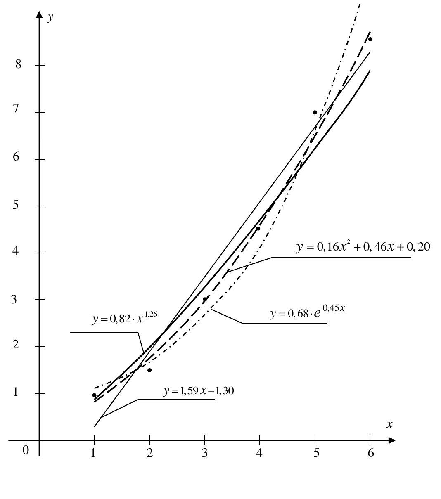

---
jupyter:
  jupytext:
    text_representation:
      extension: .md
      format_name: markdown
      format_version: '1.3'
      jupytext_version: 1.15.2
  kernelspec:
    display_name: Python 3 (ipykernel)
    language: python
    name: python3
---

# Метод наименьших квадратов (Least squares approximation)


**Цель работы:** ознакомление с методом аппроксимации функций.

Продолжительность работы: - 4 часа.

Мягкий дедлайн (10 баллов): 03.10.2023

Жесткий дедлайн (5 баллов): 17.10.2023


## Теоретические сведения


Пусть две величины $x$ и $y$ связаны табличной зависимостью, полученной, например, из опытов.

|$x$ | $x_1$ | $x_2$ | $\cdots$ | $x_n$ |
|:--:|:-----:|:-----:|:--------:|:-----:|
|$y$ | $y_1$ | $y_2$ | $\cdots$ | $y_n$ |

На плоскости $xOy$  данной таблице соответствует $n$  точек $M_i(x_i, y_i)$, где
$ i = 1, 2, 3, \ldots, n$.
Точки $M_i$ называют экспериментальными точками:


*Рисунок 1. Экспериментальные точки*

Требуется установить функциональную зависимость $y=f(x)$ между переменными
$x$ и $y$  по результатам экспериментальных исследований, приведенных в таблице.
Применение интерполяции в данном случае нецелесообразно, так как значения
$y_i$ в узлах $x_i$ получены экспериментально и поэтому являются сомнительными
(в ходе эксперимента возникает неустранимая погрешность, обусловленная неточностью измерений).

Кроме того, совпадение значений в узлах не означает совпадения характеров поведения исходной
и интерполирующей функций.
Поэтому необходимо найти такой метод подбора эмпирической формулы, который не только позволяет найти саму формулу,
но и оценить погрешность подгонки.

В общем случае искомая функция $y=f(x)$ будет зависеть не только от $x$, но и от некоторого количества параметров:
$y = f(x, a, b , \ldots)$.


### Постановка задачи

Найти аппроксимирующую функцию
\begin{equation}
    y = f(x, a, b , \ldots)
    \label{eq:01} 
    \tag{1}
\end{equation}
такую, чтобы в точках $x=x_i$ она принимала значения по возможности близкие к табличным, 
то есть график искомой функции должен проходить как можно ближе к экспериментальным точкам.
Вид функции \eqref{eq:01} может быть известен из теоретических соображений или определяться 
характером расположения экспериментальных точек $M_i$ на плоскости $xOy$.

Для отыскания коэффициентов $a, b, \ldots$ в функции \eqref{eq:01}
применяется метод наименьших квадратов (МНК), который состоит в следующем. 
Между искомой функцией и табличными значениями в точках $x_i$ наблюдаются отклонения.
Обозначим их
$\Delta y_i = f(x_i, a, b, \ldots) - y_i$, где $i = 1, 2, \ldots, n$.
Выбираем значения коэффициентов $a, b, \ldots$ так, чтобы сумма квадратов отклонений
принимала минимальное значение:
\begin{equation}
    L(a, b, \ldots) =
    \sum\limits_{i=1}^n {\left( \Delta y_i\right)^2} = 
    \sum\limits_{i=1}^n {\left( f(x_i, a, b, \ldots) - y_i \right)^2} \rightarrow \min.
    \label{eq:02} 
    \tag{2}
\end{equation}

Сумма $L(a, b, \ldots)$ является функцией нескольких переменных.
Необходимый признак экстремума функции нескольких переменных
состоит в том, что обращаются в нуль частные производные:
\begin{equation}
    L_a^\prime(a, b, \ldots) = 0, \; 
    L_b^\prime(a, b, \ldots) = 0, \;
    \ldots
    \label{eq:03} 
    \tag{3}
\end{equation}


### План решения задачи

1. Выбираем вид функции $y = f(x, a, b , \ldots)$.

2. Для отыскания коэффициентов $a, b, \ldots$ составляем систему уравнений  \eqref{eq:03}.

3. Решая систему уравнений  \eqref{eq:03}, находим значения коэффициентов $a, b, \ldots$.

4. Подставляя $a, b, \ldots$ в уравнение \eqref{eq:01}, получаем искомую функцию $y = f(x, a, b , \ldots)$.

5. По достаточному признаку экстремума функции нескольких переменных следует убедиться в постоянстве знака дифференциала
второго порядка этой функции: $d^2 L > 0$: при любых приращениях аргументов $da$, $db$, $\ldots$.
Такая проверка делается в теоретической части метода наименьших квадратов и на практике не повторяется.

6. Обычно рассматривают несколько видов функций $y = f(x, a, b , \ldots)$ и выбирают ту функцию, для которой суммарная
погрешность (функций потерь)
$\sum\limits_{i=1}^n {\left( f(x_i, a, b, \ldots) - y_i \right)^2}$
окажется наименьшей.


Рассмотрим несколько случаев подбора аппроксимирующей функции $y = f(x, a, b , \ldots)$.


### Линейная функция

\begin{equation}
    y = ax + b.
    \label{eq:04} 
    \tag{4}
\end{equation}

#### Решение

Составим функцию потерь, как функцию двух переменных, и найдем, при каких значениях $a$, $b$ эта функция принимает минимальное значение:

\begin{equation}
    L(a, b) = 
    \sum\limits_{i=1}^n {\left( ax_i + b- y_i \right)^2} \rightarrow \min.
    \label{eq:05} 
    \tag{5}
\end{equation}

По необходимому признаку экстремума частные производные функции \eqref{eq:05} должны быть равны нулю:

\begin{equation}
    \begin{cases}
        L_a^\prime(a, b) = \sum\limits_{i=1}^{n} {2(ax_i+b-y_i)\cdot x_i} = 0,\\
        L_b^\prime(a, b) = \sum\limits_{i=1}^{n} {2(ax_i+b-y_i)\cdot 1} = 0.
    \end{cases}
    \label{eq:06} 
    \tag{6}
\end{equation}

Преобразуем уравнения системы \eqref{eq:06} следующим образом:

\begin{equation}
    \begin{cases}
        \left( \sum\limits_{i=1}^{n} {x_i^2} \right) \cdot a + 
        \left( \sum\limits_{i=1}^{n} {x_i} \right) \cdot b =
        \sum\limits_{i=1}^{n} {(x_i \cdot y_i)}
        \\
        \left( \sum\limits_{i=1}^{n} {x_i} \right) \cdot a + 
        n\cdot b =
        \sum\limits_{i=1}^{n} {y_i}.
    \end{cases}
    \label{eq:07} 
    \tag{7}
\end{equation}

Таким образом, получается система линейных уравнений с двумя неизвестными $a$ и $b$. 
Коэффициенты при неизвестных $a$ и $b$ (соответствующие суммы) находятся из исходной
табличной зависимости и являются постоянными для данной выборки. 
При различных значениях $x_i$ главный определитель этой системы отличен от нуля:

\begin{equation}
    \Delta =
    \begin{vmatrix}
        \sum\limits_{i=1}^{n} {x_i^2} &  \sum\limits_{i=1}^{n} {x_i}  \\
         \sum\limits_{i=1}^{n} {x_i} & n
    \end{vmatrix}
    =
    n \cdot \sum\limits_{i=1}^{n} {x_i^2} - \left( \sum\limits_{i=1}^{n} {x_i} \right)^2   
    =
    \sum\limits_{i=1}^{n} {\sum\limits_{j=1}^{n} {(x_i - x_j)^2}} 
    \neq 0.
\end{equation}

Следовательно, система линейных уравнений \eqref{eq:07} имеет единственное решение, которое находится по формулам Крамера:

\begin{equation}
    a = \cfrac{\Delta_a}{\Delta} = 
    \cfrac
        {
             n \cdot \sum\limits_{i=1}^{n} {(x_i \cdot y_i)} 
             - 
             \sum\limits_{i=1}^{n} {x_i} \cdot \sum\limits_{i=1}^{n} {y_i}
        }
        {
            n \cdot \sum\limits_{i=1}^{n} {(x_i)^2} 
            - 
            \left( \sum\limits_{i=1}^{n} {x_i} \right)^2} .
\end{equation}

\begin{equation}
    b = \cfrac{\Delta_b}{\Delta} = 
    \cfrac{1}{n} \cdot \sum\limits_{i=1}^{n} {y_i} 
    -
    a \cdot \cfrac{1}{n} \cdot \sum\limits_{i=1}^{n} {x_i}.
\end{equation}

Подставим найденные значения $a$ и $b$ в уравнение \eqref{eq:04}, и получим искомую линейную функцию $y =ax+b$.

Убедимся, что в стационарной точке $M_0(a, b) функция $L(a, b)$ принимает минимальное значение.

Достаточным условием того, что функция двух переменных принимает минимальное значение, является постоянство знака
второго дифференциала этой функции: $d^2 L(a, b) > 0$ при любых приращениях аргументов $da$, $db$.

Дифференциал второго порядка функции  $L(a, b)$ имеет вид:

\begin{equation}
    d^2 L(a, b) =
    L_{aa}^{\prime\prime}(a, b) \cdot da^2 + 2 L_{ab}^{\prime\prime}(a, b) \cdot da db + L_{bb}^{\prime\prime}(a, b) \cdot db^2 =
    \left( 2  \sum\limits_{i=1}^{n} {x_i^2} \right) da^2 + 
        2 \left( 2  \sum\limits_{i=1}^{n} {x_i} \right) da db + (2n)db^2.
\end{equation}

Второй дифференциал является квадратичной формой второго порядка от переменных $da$ и $db$. 
Квадратичная форма принимает только положительные значения при
$da \neq 0$ и $db \neq 0$, если соответствующая ей матрица положительно определена.
Матрица квадратичной формы дифференциала второго порядка (матрица Гессе) будет иметь вид:

\begin{equation}
    H = 
    \begin{bmatrix}
        L_{aa}^{\prime\prime}(a, b) & L_{ab}^{\prime\prime}(a, b) \\ 
        L_{ab}^{\prime\prime}(a, b) & L_{bb}^{\prime\prime}(a, b) 
    \end{bmatrix}
    =
    \begin{bmatrix}
        2 \sum\limits_{i=1}^{n} {x_i^2}  & 2 \sum\limits_{i=1}^{n} {x_i} \\ 
        2 \sum\limits_{i=1}^{n} {x_i}    &  2n
    \end{bmatrix}.
\end{equation}

Найдем ее главные миноры:

\begin{equation}
    M_1 = L_{aa}^{\prime\prime}(a, b) = 2 \sum\limits_{i=1}^{n} {x_i^2} > 0,
\end{equation}

\begin{equation}
    M_2 = 
    \begin{vmatrix}
        L_{aa}^{\prime\prime}(a, b) & L_{ab}^{\prime\prime}(a, b) \\ 
        L_{ab}^{\prime\prime}(a, b) & L_{bb}^{\prime\prime}(a, b) 
    \end{vmatrix}
    =
    \begin{vmatrix}
        2 \sum\limits_{i=1}^{n} {x_i^2}  & 2 \sum\limits_{i=1}^{n} {x_i} \\ 
        2 \sum\limits_{i=1}^{n} {x_i}    &  2n
    \end{vmatrix}
    =
    4n \cdot \sum\limits_{i=1}^{n} {x_i^2} - 
        4 \cdot \left( \sum\limits_{i=1}^{n} {x_i}  \right)^2
    =
    2\cdot \sum\limits_{i=1}^{n} {\sum\limits_{j=1}^{n} {(x_i - x_j)^2}} > 0.
\end{equation}

Так как главные миноры матрицы Гессе положительны, то по критерию Сильвестра матрица положительно определена,
и квадратичная форма дифференциала $d^2 L(a, b)$, соответствующая этой матрице, принимает только положительные значения. 
Из условия $d^2 L(a, b) > 0$ следует, что $M_0(a, b) – точка минимума функции $L(a, b)$. 
Итак, коэффициенты $a$ и $b$, найденные с помощью метода наименьших квадратов, всегда определяют именно минимум функции
$L(a, b)$ . 
Более того, так как функция $L(a, b)$ имеет единственную стационарную точку $M_0(a, b), минимум функции является наименьшим 
значением $L(a, b)$.

Если коэффициенты  линейной функции найдены, можно вычислить суммарную погрешность:

\begin{equation}
    L(a, b) = 
    \sum\limits_{i=1}^{n} 
        {
            \left((ax_i+b)-y_i\right)^2
        }.
\end{equation}

Метод наименьших квадратов для линейной функции широко применяется при обработке данных не только в теории измерений, но
и в математической статистике и машинном обучении при нахождении статистических оценок параметров и построении уравнения линейной регрессии, в эконометрике при нахождении трендов, а также в других прикладных дисциплинах.


### Степенная функция

\begin{equation}
    y = \beta \cdot x^a.
    \label{eq:08} 
    \tag{8}
\end{equation}

#### Решение

Прологарифмируем по основанию $е$ функцию \eqref{eq:08} и получим новое уравнение:

\begin{equation}
    \ln{y} = a\cdot \ln{x} + \ln{\beta}.
    \label{eq:09} 
    \tag{9}
\end{equation}

Обозначим
$Y = \ln{y}$, $X = \ln{x}$, $b = \ln{\beta}$.

Тогда равенство \eqref{eq:09} примет вид $Y = a \cdot X + b$, где переменные $X$
и $Y$ связаны следующей табличной зависимостью:

| $X = \ln{x}$ | $X_1 = \ln{x_1}$ | $X_2 = \ln{x_2}$ | $\cdots$ | $X_n = \ln{x_n}$ |
|:------------:|:----------------:|:----------------:|:--------:|:----------------:|
| $Y = \ln{y}$ | $Y_1 = \ln{y_1}$ | $Y_2 = \ln{y_2}$ | $\cdots$ | $Y_n = \ln{y_n}$ |

Таким образом, задача свелась к рассмотренной выше задаче нахожднеия коэффициэнтов линейной функции. 

Решая эту задачу, находим значения коэффициентов $a$ и $b$. 

Учитывая, что $b = \ln{\beta}$, находим $\beta = e^b$.

Подставим найденные значения $a$ и $\beta$ в уравнение \eqref{eq:08} и получим искомую степенную функцию $y = \beta \cdot x^a$.

Суммарная погрешность равна
\begin{equation}
    L(a, b) = 
    \sum\limits_{i=1}^{n} 
        {
            \left(\beta \cdot x_i^a-y_i\right)^2
        }.
\end{equation}


### Показательная функция

\begin{equation}
    y = \beta \cdot e^{ax}.
    \label{eq:10} 
    \tag{10}
\end{equation}

#### Решение

Прологарифмируем по основанию $е$ функцию \eqref{eq:09} и получим новое уравнение:

\begin{equation}
    \ln{y} = a\cdot x + \ln{\beta}.
    \label{eq:11} 
    \tag{11}
\end{equation}

Обозначим
$Y = \ln{y}$, $b = \ln{\beta}$.

Тогда равенство \eqref{eq:11} примет вид $Y = a \cdot X + b$, где переменные $X$
и $Y$ связаны следующей табличной зависимостью:

| $x$          | $x_1$            | $x_2$            | $\cdots$ | $x_n$ |
|:------------:|:----------------:|:----------------:|:--------:|:----------------:|
| $Y = \ln{y}$ | $Y_1 = \ln{y_1}$ | $Y_2 = \ln{y_2}$ | $\cdots$ | $Y_n = \ln{y_n}$ |

Таким образом, задача свелась к рассмотренной выше задаче нахожднеия коэффициэнтов линейной функции. 

Решая эту задачу, находим значения коэффициентов $a$ и $b$. 

Учитывая, что $b = \ln{\beta}$, находим $\beta = e^b$.

Подставим найденные значения $a$ и $\beta$ в уравнение \eqref{eq:10} и получим искомую степенную функцию $y = \beta \cdot e^{ax}$.

Суммарная погрешность равна
\begin{equation}
    L(a, b) = 
    \sum\limits_{i=1}^{n} 
        {
            \left(\beta \cdot e^{ax_i}-y_i\right)^2
        }.
\end{equation}


### Квадратичная функция

\begin{equation}
    y = ax^2 + bx + c.
    \label{eq:12} 
    \tag{12}
\end{equation}

#### Решение

Составим функцию трех переменных и найдем, при каких значениях $a$, $b$, $c$ эта функция принимает минимальное значение:

\begin{equation}
    L(a, b, c) = 
    \sum\limits_{i=1}^n {\left( ax_i^2 + bx + c - y_i \right)^2} \rightarrow \min.
    \label{eq:13} 
    \tag{13}
\end{equation}

Функция $L(a, b, c)$ будет принимать минимальное значение, если частные  производные
$L_a^\prime(a, b, c)$, $L_b^\prime(a, b, c)$, $L_b^\prime(a, b, c)$ обращаются в нуль:

\begin{equation}
    \begin{cases}
        L_a^\prime(a,b,c) = \sum\limits_{i=1}^{n} {2(ax_i^2+bx_i + c - y_i)\cdot x_i^2} = 0,\\
        L_b^\prime(a,b,c) = \sum\limits_{i=1}^{n} {2(ax_i^2+bx_i + c - y_i)\cdot x_i} = 0,\\
        L_c^\prime(a,b,c) = \sum\limits_{i=1}^{n} {2(ax_i^2+bx_i + c - y_i)\cdot 1} = 0.\\
    \end{cases}
    \label{eq:14} 
    \tag{14}
\end{equation}

Преобразуем уравнения системы \eqref{eq:14} следующим образом:

\begin{equation}
    \begin{cases}
        \left( \sum\limits_{i=1}^{n} {x_i^4} \right) \cdot a + 
            \left( \sum\limits_{i=1}^{n} {x_i^3} \right) \cdot b +
                \left( \sum\limits_{i=1}^{n} {x_i^2} \right) \cdot c =
        \sum\limits_{i=1}^{n} {(x_i^2 \cdot y_i)}
        \\
        \left( \sum\limits_{i=1}^{n} {x_i^3} \right) \cdot a + 
            \left( \sum\limits_{i=1}^{n} {x_i^2} \right) \cdot b +
                \left( \sum\limits_{i=1}^{n} {x_i} \right) \cdot c =
        \sum\limits_{i=1}^{n} {(x_i \cdot y_i)}
        \\
        \left( \sum\limits_{i=1}^{n} {x_i^2} \right) \cdot a + 
            \left( \sum\limits_{i=1}^{n} {x_i} \right) \cdot b +
                n \cdot c =
        \sum\limits_{i=1}^{n} {y_i}.
    \end{cases}
    \label{eq:15} 
    \tag{15}
\end{equation}

Получили систему трех линейных уравнений с тремя неизвестными $a$, $b$, $c$. 
Аналогично случаю двух переменных, эта система имеет единственное решение. 
Кроме того, можно доказать, что коэффициенты, найденные с помощью метода наименьших
квадратов, всегда определяют именно минимум функции $L(a, b, c)$.

Решая систему уравнений, найдем значения коэффициентов $a$, $b$, $c$. 
Подставим найденные значения $a$, $b$, $c$ в уравнение \eqref{eq:12}, и получим искомую квадратичную функцию 
$y = ax^2 + bx + c$.

Суммарная погрешность равна
\begin{equation}
    L(a, b) = 
    \sum\limits_{i=1}^{n} 
        {
            \left(a x_i^2 + bx_i + c - y_i\right)^2
        }.
\end{equation}

<!-- #region -->
## Задание

Дана таблица значений некоторой функциональной зависимости, полученной из $n = 6$ опытов

1. Методом наименьших квадратов по данной табличной зависимости найти аппроксимирующую функцию в виде:

  1.1) линейной функции $y = ax + b$;

  1.2) степенной функции $y = \beta \cdot x^a$;

  1.3) показательной функции $y = \beta \cdot e^{ax}$;

  1.4) квадратичной функции $y = ax^2 + bx + c$.

2. Построить в плоскости $xOy$ графики полученных функций и нанести экспериментальные точки.

3. Сравнить полученные результаты.


Промежуточные вычисления вести с точностью до 0,0001.

Значения параметров $a$, $b$, $c$ округлить до 0,01.
<!-- #endregion -->

<!-- #region -->
### Варианты индивидуальных заданий

Вариант 1

|$x$ | 2   | 3   | 4   | 5   | 6   | 7   |
|:--:|:---:|:---:|:---:|:---:|:---:|:---:|
|$y$ | 100 | 190 | 270 | 400 | 500 | 690 |


Вариант 2

|$x$ | 10   | 20   | 30   | 40   | 50   | 60   |
|:--:|:----:|:----:|:----:|:----:|:----:|:----:|
|$y$ | 1,06 | 1,33  | 1,52 | 1,68 | 1,81 | 1,91 |

Вариант 3

|$x$ | 3    | 5    | 7    | 9    | 11   | 13   |
|:--:|:----:|:----:|:----:|:----:|:----:|:----:|
|$y$ | 26   | 76   | 150  | 240  | 360  | 500  |

Вариант 4 

|$x$ | 2 | 6 | 10 | 14 | 18 | 22 | 
|:--:|:---:|:---:|:---:|:---:|:---:|:---:|
|$y$ | 3,1 | 6,7 | 9,5 | 11,9 | 14,0 | 15,5 | 

Вариант 5 

|$x$ | 1 | 3 | 5 | 7 | 9 | 11 | 
|:--:|:---:|:---:|:---:|:---:|:---:|:---:|
|$y$ | 2,0 | 10,1 | 22,6 | 37,1 | 54,5 | 73,2 | 

Вариант 6  

|$x$ | 1 | 4 | 7 | 10 | 13 | 16 | 
|:--:|:---:|:---:|:---:|:---:|:---:|:---:|
|$y$ | 3,0 | 7,6 | 11,2 | 13,8 | 17,1 | 19,5 | 

Вариант 7  

|$x$ | 3 | 5 | 7 | 9 | 11 | 13 | 
|:--:|:---:|:---:|:---:|:---:|:---:|:---:|
|$y$ | 3,5 | 4,4 | 5,7 | 6,1 | 6,5 | 7,3 |  

Вариант 8  

|$x$ | 2 | 5 | 8 | 11 | 14 | 17 | 
|:--:|:---:|:---:|:---:|:---:|:---:|:---:|
|$y$ | 2,1 | 1,3 | 1,0 | 0,9 | 0,8 | 0,72 | 

Вариант 9  

|$x$ | 1 | 5 | 9 | 13 | 17 | 21 | 
|:--:|:---:|:---:|:---:|:---:|:---:|:---:|
|$y$ | 2,0 | 3,4 | 4,2 | 4,6 | 5,2 | 5,4 | 

Вариант 10

|$x$ | 3 | 4 | 5 | 6 | 7 | 8 | 
|:--:|:---:|:---:|:---:|:---:|:---:|:---:|
|$y$ | 13 | 31 | 64 | 105 | 170 | 252 | 

Вариант 11 

|$x$ | 2 | 4 | 6 | 8 | 10 | 12 | 
|:--:|:---:|:---:|:---:|:---:|:---:|:---:|
|$y$ | 2,4 | 2,9 | 3,0 | 3,5 | 3,6 | 3,7 | 

Вариант 12  

|$x$ | 10 | 14 | 18 | 22 | 26 | 30 | 
|:--:|:---:|:---:|:---:|:---:|:---:|:---:|
|$y$ | 4,2 | 4,5 | 4,8 | 5,1 | 5,2 | 5,4 | 

Вариант 13  

|$x$ | 1 | 16 | 13 | 46 | 61 | 76 | 
|:--:|:---:|:---:|:---:|:---:|:---:|:---:|
|$y$ | 0,5 | 4,0 | 6,9 | 8,8 | 10,9 | 12,1 | 

Вариант 14  

|$x$ | 5 | 15 | 25 | 35 | 45 | 55 | 
|:--:|:---:|:---:|:---:|:---:|:---:|:---:|
|$y$ | 2,2 | 2,4 | 2,6 | 2,7 | 2,8 | 2,9 | 

Вариант 15  

|$x$ | 1 | 2 | 3 | 4 | 5 | 6 | 
|:--:|:---:|:---:|:---:|:---:|:---:|:---:|
|$y$ | 2,0 | 0,68 | 0,44 | 0,24 | 0,12 | 0,14 | 

Вариант 16  

|$x$ | 2 | 3 | 4 | 5 | 6 | 7 | 
|:--:|:---:|:---:|:---:|:---:|:---:|:---:|
|$y$ | 2,0 | 4,3 | 8,1 | 12,1 | 18,1 | 36,2 | 

Вариант 17  

|$x$ | 2 | 5 | 8 | 11 | 14 | 17 | 
|:--:|:---:|:---:|:---:|:---:|:---:|:---:|
|$y$ | 4,8 | 8,8 | 12,1 | 15,0 | 17,4 | 19,7 | 

Вариант 18  

|$x$ | 5 | 7 | 9 | 11 | 13 | 15 | 
|:--:|:---:|:---:|:---:|:---:|:---:|:---:|
|$y$ | 5,6 | 9,2 | 13,6 | 18,3 | 23,5 | 29,1 | 

Вариант 19  

|$x$ | 25 | 40 | 55 | 70 | 85 | 100 | 
|:--:|:---:|:---:|:---:|:---:|:---:|:---:|
|$y$ | 2,4 | 3,2 | 3,8 | 4,3 | 4,7 | 5,1 | 

Вариант 20  

|$x$ | 2 | 3 | 4 | 5 | 6 | 7 | 
|:--:|:---:|:---:|:---:|:---:|:---:|:---:|
|$y$ | 2,8 | 2,4 | 2,0 | 1,5 | 1,3 | 1,2 | 

Вариант 21  

|$x$ | 21 | 32 | 43 | 54 | 65 | 76 | 
|:--:|:---:|:---:|:---:|:---:|:---:|:---:|
|$y$ | 5,4 | 6,3 | 7,1 | 7,6 | 8,1 | 8,5 | 

Вариант 22  

|$x$ | 2 | 5 | 8 | 11 | 14 | 17 | 
|:--:|:---:|:---:|:---:|:---:|:---:|:---:|
|$y$ | 1,6 | 24,9 | 102,8 | 266,8 | 549,0 | 982,0 | 

Вариант 23  

|$x$ | 100 | 150 | 200 | 250 | 300 | 350 | 
|:--:|:---:|:---:|:---:|:---:|:---:|:---:|
|$y$ | 9,6 | 10,4 | 11,2 | 12,1 | 12,7 | 13,2 | 

Вариант 24  

|$x$ | 220 | 320 | 420 | 520 | 620 | 720 | 
|:--:|:---:|:---:|:---:|:---:|:---:|:---:|
|$y$ | 5,2 | 5,2 | 5,4 | 5,6 | 5,8 | 6,1 | 

Вариант 25  

|$x$ | 10 | 35 | 60 | 85 | 110 | 135 | 
|:--:|:---:|:---:|:---:|:---:|:---:|:---:|
|$y$ | 11,2 | 28,8 | 43,2 | 56,2 | 67,8 | 79,2 | 

Вариант 26  

|$x$ | 10 | 15 | 20 | 25 | 30 | 35 | 
|:--:|:---:|:---:|:---:|:---:|:---:|:---:|
|$y$ | 10,8 | 18,4 | 27,1 | 36,6 | 46,6 | 57,2 | 

Вариант 27  

|$x$ | 2 | 4 | 6 | 8 | 10 | 12 | 
|:--:|:---:|:---:|:---:|:---:|:---:|:---:|
|$y$ | 1,08 | 0,36 | 0,21 | 0,12 | 0,09 | 0,04 | 

Вариант 28  

|$x$ | 10 | 15 | 20 | 25 | 30 | 35 | 
|:--:|:---:|:---:|:---:|:---:|:---:|:---:|
|$y$ | 4,30 | 3,30 | 2,68 | 2,25 | 1,90 | 1,70 |  

Вариант 29  

|$x$ | 10 | 20 | 30 | 40 | 50 | 60 | 
|:--:|:---:|:---:|:---:|:---:|:---:|:---:|
|$y$ | 1,08 | 1,31 | 1,53 | 1,69 | 1,80 | 1,92 | 

Вариант 30  

|$x$ | 3 | 5 | 7 | 9 | 11 | 13 | 
|:--:|:---:|:---:|:---:|:---:|:---:|:---:|
|$y$ | 27 | 75 | 152 | 241 | 362 | 498 |
<!-- #endregion -->

### Образец решения типового варианта

|$x$ | 1   | 2   | 3   | 4   | 5   | 6   |
|:--:|:---:|:---:|:---:|:---:|:---:|:---:|
|$y$ | 1,0 | 1,5 | 3,0 | 4,5 | 7,0 | 8,5 |


1.1  Найдем зависимость $y$ от $x$ в виде линейной функции $y = ax + b$.

Выберем значения коэффициентов $a$ и $b$ так, чтобы сумма квадратов отклонений
$ L(a, b) = \sum\limits_{i=1}^n (\Delta y_i)^2 = 
\sum\limits_{i=1}^{n} { \left((ax_i+b)-y_i\right)^2}$
была минимальной.

Имеем, 

$\sum\limits_{i=1}^{6} {x_i} = 1 + 2 + 3 + 4 + 5 + 6 = 21$,

$\sum\limits_{i=1}^{6} {y_i} =  1,0 + 1,5 + 3,0 + 4,5 + 7,0 + 8,5 = 25,5$,

$\sum\limits_{i=1}^{6} {x_i^2} = 1^2 + 2^2 + 3^2 + 4^2 + 5^2 + 6^2 = 1 + 4 + 9 + 16 + 25 + 36 =91$,

$\sum\limits_{i=1}^{6} {(x_i \cdot y_i)} = 
1\cdot 1,0 + 2\cdot 1,5 + 3\cdot 3,0 + 4\cdot 4,5 + 5\cdot 7,0 + 6\cdot 8,5 = 
1,0 + 3,0 + 9,0 + 18,0 + 35,0 + 51,0 = 117,0$.

Тогда система уравнений \eqref{eq:07} примет вид:

\begin{equation}
    \begin{cases}
        91a + 21b = 117, \\
        21a + 6b = 25,5.
    \end{cases}
\end{equation}

Решим систему уравнений по формулам Крамера:

\begin{equation}
    a = \cfrac{\Delta_a}{\Delta}, \;
    b = \cfrac{\Delta_b}{\Delta},
\end{equation}
где
\begin{equation}
    \Delta =
    \begin{vmatrix}
        91 & 21 \\
        21 & 6
    \end{vmatrix} = 91 \cdot 6 - 21 \cdot 21 = 105, 
\end{equation}
\begin{equation}
    \Delta_a =
    \begin{vmatrix}
        117 & 21 \\
        25,5 & 6
    \end{vmatrix} = 17 \cdot 6 - 21 \cdot 25,5 = 166,5, 
    \quad
    \Delta_b =
    \begin{vmatrix}
        91 & 117 \\
        21 & 25,5 
    \end{vmatrix} = 91 \cdot 25,5 - 117 \cdot 21 = -136,5. 
\end{equation}

Тогда,
\begin{equation}
    a = \cfrac{\Delta_a}{\Delta} = \cfrac{166,5}{105} = 1,59, 
    \quad
    b = \cfrac{\Delta_b}{\Delta} = \cfrac{-136,5}{105} = -1,30.
\end{equation}

Следовательно, искомая линейная функция будет иметь вид:
\begin{equation}
    y = 1,59 x - 1,30.
\end{equation}


1.2  Найдем зависимость $y$ от $x$ в виде степенной функции $y = \beta \cdot x^a$.

Прологарифмировав равенство $y = \beta \cdot x^a$ по основанию $e$, получим
$\ln{y} = a\cdot \ln{x} + \ln{\beta}$.

Обозначим
$Y = \ln{y}$, $X = \ln{x}$, $b = \ln{\beta}$.

Тогда получим линейную функцию $Y = a \cdot X + b$, где переменные $X$ и $Y$ связаны следующей табличной зависимостью:

|$X = \ln{x}$ | 0 | 0,6931 | 1,0986 | 1,3863 | 1,6094 | 1,7918 |
|:------------|:---:|:---:|:---:|:---:|:---:|:---:|
|$Y = \ln{y}$ |  0 | 0,4055 | 1,0986 | 1,5041 | 1,9459 | 2,1401 |

Таким образом, данная задача свелась к задаче 1.1.

Имеем,

$\sum\limits_{i=1}^{6} {\ln{x_i}} = 0 + 0,6931 + 1,0986 + 1,3863 + 1,6094 + 1,7918 = 6,5792$,

$\sum\limits_{i=1}^{6} {\ln{y_i}} =   0 + 0,4055 + 1,0986 + 1,5041 + 1,9459 + 2,1401 = 7,0942$,

$\sum\limits_{i=1}^{6} {\ln^2{x_i}} = 0^2 + 0,6931^2 + 1,0986^2 + 1,3863^2 + 1,6094^2 + 1,7918^2 = 
0,0000 + 0,4805 + 1,2069 + 1,9218 + 2,5903 + 3,2104 = 9,4099 $,

$\sum\limits_{i=1}^{6} {(\ln{x_i} \cdot \ln{y_i})}
 = 0\cdot 0 + 0,6931\cdot0,4055 + 1,0986\cdot 1,0986 + 1,3863\cdot 1,5041 + 1,6094\cdot 1,9459 + 1,7918\cdot 2,1401 =$
$ = 0,0000 + 0,2810 + 1,2069 + 2,0851 + 3,1318 + 3,8345 = 10,5393$.

Система уравнений \eqref{eq:07} будет иметь вид:

\begin{equation}
    \begin{cases}
        9,4099 a + 6,5792 b = 10,5393, \\
        6,5792 a + 6b = 7,0942.
    \end{cases}
\end{equation}

Определители системы:
\begin{equation}
    \Delta =
    \begin{vmatrix}
        9,4099  & 6,5792 \\
        6,5792 & 6
    \end{vmatrix} = 9,4099 \cdot 6 - 6,5792 \cdot 6,5792 = 13,1735,
\end{equation}
\begin{equation}
    \Delta_a =
    \begin{vmatrix}
        10,5393 & 6,5792 \\
        7,0942 & 6
    \end{vmatrix} = 10,5393 \cdot 6 - 6,5792  \cdot 7,0942 = 16,5628, 
    \quad
    \Delta_b =
    \begin{vmatrix}
        9,4099 &  10,5395 \\
        6,5792 &  7,0942 
    \end{vmatrix} = 9,4099 \cdot 7,0942 - 10,5395  \cdot 6,5792 = -2,5858. 
\end{equation}

Тогда,
\begin{equation}
    a = \cfrac{\Delta_a}{\Delta} = \cfrac{16,5628}{13,1735} = 1,26, 
    \quad
    b = \cfrac{\Delta_b}{\Delta} = \cfrac{-2,5858}{13,1735} = -0,20.
\end{equation}

Учитывая, что $b = \ln{\beta}$, находим $\beta = e^b = e^{-0,20} = 0,82$, 
и получаем искомую степенную функцию 
\begin{equation}
    y = 0,82 \cdot x^{1,26}.
\end{equation}

<!-- #region -->
1.3  Найдем зависимость $y$ от $x$ в виде показательной функции $y = \beta \cdot e^{ax}$.


Прологарифмировав равенство $y = \beta \cdot e^{ax}$ по основанию $e$, получим
$\ln{y} = ax  + \ln{\beta}$.

Обозначим
$Y = \ln{y}$, $b = \ln{\beta}$.

Тогда получим линейную функцию $Y = a \cdot x + b$, где переменные $x$ и $Y$ связаны следующей табличной зависимостью:

|$x         $ | 1 | 2 | 3 | 4 | 5 | 6 |
|:------------|:---:|:---:|:---:|:---:|:---:|:---:|
|$Y = \ln{y}$ |  0 | 0,4055 | 1,0986 | 1,5041 | 1,9459 | 2,1401 |

Таким образом, данная задача свелась к задаче 1.1.

Имеем,

$\sum\limits_{i=1}^{6} {x_i} = 1 + 2 + 3 + 4 + 5 + 6 = 21$,

$\sum\limits_{i=1}^{6} {x_i^2} = 1^2 + 2^2 + 3^2 + 4^2 + 5^2 + 6^2 = 1 + 4 + 9 + 16 + 25 + 36 =91$,

$\sum\limits_{i=1}^{6} {\ln{y_i}} = 0 + 0,4055 + 1,0986 + 1,5041 + 1,9459 + 2,1401 = 7,0942$,

$\sum\limits_{i=1}^{6} {(x_i \cdot \ln{y_i})}
 = 1\cdot 0 + 2\cdot0,4055 + 3\cdot 1,0986 + 4\cdot 1,5041 + 5\cdot 1,9459 + 6\cdot 2,1401 =$
$ = 0,0000 + 0,8109 + 3,2958 + 6,0163 + 9,7296 + 12,8404 = 32,6930$.

Система уравнений \eqref{eq:07} будет иметь вид:

\begin{equation}
    \begin{cases}
        91 a + 21 b = 32,6930, \\
        21 a + 6b = 7,0942.
    \end{cases}
\end{equation}

Определители системы:
\begin{equation}
    \Delta =
    \begin{vmatrix}
        91  & 21 \\
        21 & 6
    \end{vmatrix} = 91 \cdot 6 - 21 \cdot 21 = 105,
\end{equation}
\begin{equation}
    \Delta_a =
    \begin{vmatrix}
        32,6930 & 21 \\
        7,0942 & 6
    \end{vmatrix} = 32,6930 \cdot 6 - 21  \cdot 7,0942 = 47,1816, 
    \quad
    \Delta_b =
    \begin{vmatrix}
        91 &  32,6930 \\
        21 &  7,0942 
    \end{vmatrix} = 91 \cdot 7,0942 - 32,6930  \cdot 21 = -40,9871. 
\end{equation}

Тогда,
\begin{equation}
    a = \cfrac{\Delta_a}{\Delta} = \cfrac{47,1816}{105} = 0,45, 
    \quad
    b = \cfrac{\Delta_b}{\Delta} = \cfrac{-0,39}{105} = -0,39.
\end{equation}

Учитывая, что $b = \ln{\beta}$, находим $\beta = e^b = e^{-0,39} = 0,68$, 
и получаем искомую степенную функцию 
\begin{equation}
    y = 0,68 \cdot x^{0,45}.
\end{equation}
<!-- #endregion -->

1.4 Найдем зависимость $y$ от $x$ в виде показательной функции $y = ax^2 + bx + c$.

Имеем,

$\sum\limits_{i=1}^{6} {x_i} = 1 + 2 + 3 + 4 + 5 + 6 = 21$,

$\sum\limits_{i=1}^{6} {x_i^2} = 1^2 + 2^2 + 3^2 + 4^2 + 5^2 + 6^2 = 1 + 4 + 9 + 16 + 25 + 36 = 91$,

$\sum\limits_{i=1}^{6} {x_i^3} = 1^3 + 2^3 + 3^3 + 4^3 + 5^3 + 6^3 = 1 + 8 + 27 + 64 + 125 + 216 = 441$,

$\sum\limits_{i=1}^{6} {x_i^4} = 1^4 + 2^4 + 3^4 + 4^4 + 5^4 + 6^4 = 1 + 16 + 81 + 256 + 625 + 1296 = 2275$,

$\sum\limits_{i=1}^{6} {y_i} =  1,0 + 1,5 + 3,0 + 4,5 + 7,0 + 8,5 = 25,5$,

$\sum\limits_{i=1}^{6} {(x_i \cdot y_i)} = 
1\cdot 1,0 + 2\cdot 1,5 + 3\cdot 3,0 + 4\cdot 4,5 + 5\cdot 7,0 + 6\cdot 8,5 = 
1,0 + 3,0 + 9,0 + 18,0 + 35,0 + 51,0 = 117,0$.

$\sum\limits_{i=1}^{6} {(x_i \cdot y_i)} = 
1\cdot 1,0 + 4\cdot 1,5 + 9\cdot 3,0 + 16\cdot 4,5 + 25\cdot 7,0 + 36\cdot 8,5 = 
1,0 + 6,0 + 27,0 + 72,0 + 175,0 + 306,0 = 587,0$.

Система уравнений \eqref{eq:15} будет иметь вид:

\begin{equation}
    \begin{cases}
        2275 a + 441 b + 91 c = 587,\\
        441 a + 91b + 21c = 117,\\
        91 a + 21 b + 6 c = 25,5.
    \end{cases}
\end{equation}

Решим систему уравенией методом Крамера, учитывая что:

$\Delta = 3920$, 
$\Delta_a = 630$, 
$\Delta_b = 1906$, 
$\Delta_c = 784$.

Получим,
\begin{equation}
    a = \cfrac{\Delta_a}{\Delta} = \cfrac{630}{3920} = 0,16, 
    \quad
    b = \cfrac{\Delta_b}{\Delta} = \cfrac{1806}{3920} = 0,46,
    \quad
    с = \cfrac{\Delta_с}{\Delta} = \cfrac{784}{3920} = 0,20.
\end{equation}

Следовательно, искомая квадратичная функция будет иметь вид:
\begin{equation}
    y = 0,16 x^2 + 0,46 x + 0,20.
\end{equation}


2. Построим в плоскости $xOy$ графики полученных функций и нанесем экспериментальные точки (Рисунок 2).


*Рисунок 2. Графики аппроксимирующих функций и экспериментальные точки*

<!-- #region -->
3. Сравним полученные результаты. Для этого найдем соответствующие суммарные погрешности

\begin{equation}
   L(a, b) = \sum\limits_{i=1}^6 {(\Delta y_i)^2}
\end{equation}
для этого составим таблицу значений полученных функций


|$x$                            | 1    | 2    | 3    | 4    | 5    | 6     |
|:-----------------------------:|:----:|:----:|:----:|:----:|:----:|:-----:|
|$y$                            | 1,0  | 1,5  | 3,0  | 4,5  | 7,0  | 8,5   |
|$y_{I} = 1,59x - 1,30$             | 0,29 | 1,88 | 3,47 | 5,06 | 6,65 | 8,24  |
|$y_{II} = 0,82\cdot x^{1,26}$       | 0,82 | 1,96 | 3,27 | 4,70 | 6,23 | 7,84  |
|$y_{III} = 0,68\cdot e^{0,45 x}$     | 1,07 | 1,67 | 2,62 | 4,11 | 6,45 | 10,12 |
|$y_{IV} = 0,16 x^2 + 0,46 x + 0,20$ | 0,82 | 1,76 | 3,02 | 4,60 | 6,50 | 8,72  |


$L_{I}(a, b) = (1,0 - 0,29)^2 + (1,5 - 1,88)^2 + (3,0 - 3,47)^2 + (4,5 - 5,06)^2 + (7,0 - 6,65)^2 + (8,5 - 8,24)^2= 1,36$,

$L_{II}(a, b) = (1,0 - 0,82)^2 + (1,5 - 1,96)^2 + (3,0 - 3,27)^2 + (4,5 - 4,70)^2 + (7,0 - 6,23)^2 + (8,5 -7,84)^2= 1,38 $,

$L_{III}(a, b) = (1,0 - 1,07)^2 + (1,5 - 1,67)^2 + (3,0 - 2,62)^2 + (4,5 - 4,11)^2 + (7,0 - 6,45)^2 + (8,5 - 10,12)^2= 3,24$,

$L_{IV}(a, b) = (1,0 - 0,82)^2 + (1,5 - 1,76)^2 + (3,0 - 3,02)^2 + (4,5 - 4,60)^2 + (7,0 - 6,50)^2 + (8,5 - 8,72)^2= 0,41$.
<!-- #endregion -->

### Вывод

В данной задаче лучшей аппроксимирующей функцией является квадратичная функция $y = 0,16 x^2 + 0,46 x + 0,20$.

```python

```
