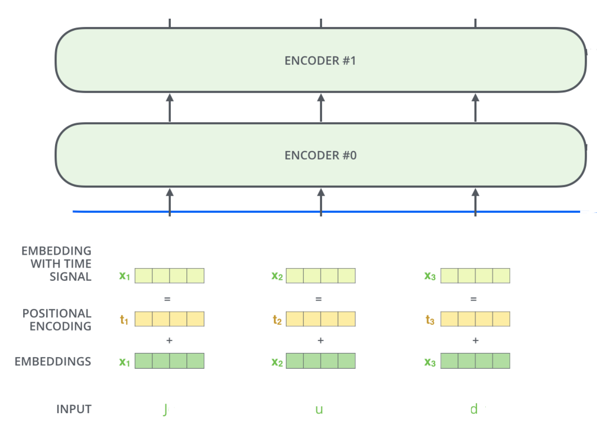

---
jupyter:
  jupytext:
    formats: ipynb,md
    text_representation:
      extension: .md
      format_name: markdown
      format_version: '1.3'
      jupytext_version: 1.16.1
  kernelspec:
    display_name: Python 3 (ipykernel)
    language: python
    name: python3
---

<!-- #region id="Dv2skd3-53rx" -->
# Нейросети в задачих обработки текстов. Генерация коротких текстов с помощью Transformer
<!-- #endregion -->

### Продолжительность и сроки сдачи

Продолжительность работы: - 4 часа.

Мягкий дедлайн (5 баллов): 16.05.2024

Жесткий дедлайн (2.5 баллов): 31.05.2024


**Цель работы:** изучить возможность генерации текстов с помощью нейросетей.

<!-- #region id="ozLuJF3kIaPF" -->
Генерировать тексты можно как с помощью RNN, так и с помощью Transformer, предсказывая следующий символ последовательности по предыдущим. Мы будем использовать архитектуру Transformer.

В этом задании предлагается написать и проучить на небольшом датасете имен генеративную модель на основе символов.
<!-- #endregion -->

```python id="a_s_Z5lbIaPG"
import numpy as np
import random
import torch
import matplotlib.pyplot as plt
%matplotlib inline

random.seed(42)
np.random.seed(42)
torch.manual_seed(42)
if torch.cuda.is_available():
    torch.cuda.manual_seed_all(42)
```

<!-- #region id="n6nXxU8WIaPM" -->
В файле `names` находится почти 8000 имен на латинице.

Модель будет получать на вход имя `Amandy` и выдавать его же, только со сдвигом: `mandy `.

Чтобы сеть училась генерировать заглавные буквы, добавим в начало специальный токен `_`.

Также нам потребуется правило для останова генерации (это может быть просто ограничение на количество шагов). С другой стороны, можно добавить в конец каждого примера обучающей выборки специальный `<EOS>` токен. Обозначим его, например, как `#`:

```
_Amandy --> Amandy#
```

Можно прекращать генерацию при досрочном выпадании `<EOS>`.

Для генерации на каждом шаге будем подавать на вход букву, предсказанную на предыдущем шаге.
<!-- #endregion -->

```python id="TFRHva2zIaPN"
import os
start_token = "_"
eos = '#'

with open("names") as f:
    names = f.readlines()
    names = [start_token + name.strip() + eos for name in names]

names = list(set(names))  # в датасете есть повторы
print(f'There are {len(names)} names: ')
for x in names[::1000]:
    print(x)
```

```python id="DSve0HBaIaPS"
# TODO: постройте частоты употреблений букв
<your code>
# HINT: для графика возьмите plt.bar
```

```python id="QAeSKss4IaPV"
# в датасете есть слова с разными длинами
MAX_LENGTH = max(map(len,names))
print("max length =", MAX_LENGTH)

plt.title('Sequence length distribution')
plt.hist(list(map(len,names)), bins=25);
```

```python id="cWnDPWr9IaPY"
names[:10]
```

```python id="zgB0VE9BIaPa"
# TODO: отберите уникальные токены и заполните два словаря для конвертации токенов <-> индексы
# сделайте так, чтобы start_token имел номер 0
    
tokens = <your code>
    
tok2id = <your code>
id2tok = <your code>

n_tokens = len(tokens)
print (f'There are {n_tokens} tokens')

assert 50 < n_tokens < 60

print('Vocabular: ' + "".join(tokens))
```

```python id="jF_ukJotIaPd"
def to_matrix(names, max_len=None, pad=tok2id[' '], dtype=np.int64):
    """Casts a list of names into matrix"""
    
    max_len = max_len or max(map(len, names))
    names_ix = np.zeros([len(names), max_len], dtype) + pad

    for i in range(len(names)):
        name_ix = list(map(tok2id.get, names[i]))
        names_ix[i, :len(name_ix)] = name_ix

    return names_ix
```

```python id="wmg_il5MIaPg"
print('\n'.join(names[:10]))
print(to_matrix(names[:10]))
```

```python id="64C8xOqCIaPk"
# TODO: разбейте все имена на тренировочную (80%) и тестовую часть (20%)
def split_data(names):
    <your code>
```

```python id="64C8xOqCIaPk"
train_data, val_data = split_data(names)

len(train_data), len(val_data)
```

<!-- #region id="NhgqoEHOIaPr" -->
# Char-Transformer для имен

Вам нужно написать сеть, кодирующую входные символы и их позиции с помощью таблиц Embeddings. 
Получившиеся тензоры пропустить через `TransformerEncoder`, затем преобразовать в логиты для предсказания новых символов.

Transformer может обрабатывать сразу всю последовательность за один проход. Для того, чтобы у модели не было возможности "заглянуть в будущее", то есть использовать информацию о впреди идущих символах, необходимо сгенерировать маску. `TransformerEncoder` должен принимать на вход последовательность символов и маску.    


<!-- #endregion -->

```python id="mfGnm2QoIaPo"
import torch.nn as nn
from torch.nn import functional as F
from torch import optim
from IPython.display import clear_output
```

```python id="KJCf0LYIIaPt"
# TODO: заполните пропуски

class NameTransformer(nn.Module):
    def __init__(self, vocab_size, emb_size, hidden_size, n_layers=2, n_head=2, dropout=0.1):
        super(NameTransformer, self).__init__()
        self.vocab_size = vocab_size

        <your code>
        
        self.register_buffer("position_ids", torch.arange(MAX_LENGTH).unsqueeze(1))

    def _generate_square_subsequent_mask(self, seq_len):
        # TODO: сгенерируйте маску размера seq_len x seq_len
        # если во время кодирования i-го символа j-й символ доступен, 
        # то (i,j) элемент маски равен 0, иначе -inf
        
        <your code>

        return mask
        
    def forward(self, input):

        <your code>

        return output
```

<!-- #region id="BmkgMHc8IaPu" -->
# Код для тренировки
<!-- #endregion -->

```python id="S164svO9IaPw"
def train_epoch(model, optimizer, train_batches):
    loss_log = []
    model.train()
    
    for batch in train_batches:
        
        nums = to_matrix(batch)
        <your code>
            
        loss = loss.item()
        loss_log.append(loss)
    return loss_log   

def test(model, test_batches):
    loss_log = []
    model.eval()
    for batch in test_batches:  
        
        nums = to_matrix(batch)
        <your code>
        
        loss = loss.item()
        loss_log.append(loss)
    return loss_log

def plot_history(train_history, val_history, title='loss'):
    plt.figure()
    plt.title('{}'.format(title))
    plt.plot(train_history, label='train', zorder=1)    
    points = np.array(val_history)
    plt.scatter(points[:, 0], points[:, 1], marker='+', s=180, c='orange', label='val', zorder=2)
    plt.xlabel('train steps')
    plt.legend(loc='best')
    plt.grid()
    plt.show()
    
def train(model, opt, n_epochs):
    train_log = []
    val_log = []
    
    bs = 32
    total_steps = 0
    train_batches = np.array_split(train_data, len(train_data) // bs)
    test_batches = np.array_split(val_data, len(val_data) // bs)
    for epoch in range(n_epochs):
        train_loss = train_epoch(model, opt, train_batches)
        train_log.extend(train_loss)
        total_steps += len(train_batches)
        
        val_loss = test(model, test_batches)
        train_log.extend(train_loss)
        
        val_log.append((len(train_log), np.mean(val_loss)))
        
        clear_output()
        plot_history(train_log, val_log)
```

```python id="Sxrc0a10IaPy"
model = NameTransformer(len(tokens), 64, 64, n_layers=2, n_head=2, dropout=0.1)

opt = torch.optim.Adam(model.parameters(), lr=1e-3)
train(model, opt, 5)
```

<!-- #region id="ffTAktWAIaP5" -->
# Генерация по argmax
<!-- #endregion -->

```python id="ugRlkX2ZIaP6"
# Напишите функцию генерации продолжения строки
def pick_by_argmax(logits):
    <your code>

def ids2string(ids):
    return "".join(id2tok[_] for _ in ids)


def gen_continuation(model, prefix="_"):
    nums = to_matrix(prefix)
    nums = torch.from_numpy(nums)
    
    # TODO: сначала подайте на вход префикс
    # нас интересует последний output, чтобы получить первое предсказание
    <your code>
    
    # TODO: затем сгенерируйте несколько последующих символов
    # outs -- это массив с номерами токенов
    <your code>
    
    print(prefix + '|'+ ids2string(outs))
    
gen_continuation(model, " Ku")
```

<!-- #region id="00547AA-IaP_" -->
# Генерация с семплированием

Обычный софтмакс 
$$p_i = \frac{\exp (x_i)}{\sum \exp (x_j)}$$
можно модернизировать с помощью температуры:
$$p_i = \frac{\exp (x_i / T)}{\sum \exp (x_j / T)}$$

Это позволит плавно переходить от выбора наиболее вероятного элемента ($T << 1$) до практически равновероятного ($T >> 1$)

<!-- #endregion -->

```python id="71cOcFxpIaQA"
# Напишите функцию генерации батчами с семплированием из распределения и температурой
def batch2string(ids, prefix):
    # модифицируйте ids2string для работы с батчами
    <your code>

def pick_by_distribution(logits):
    # превратите логиты в распределение
    # затем семлируйте из него batch примеров
    <your code>


def gen_continuation_temp(model, prefix="_", temperature=1.0, n=10):
    nums = to_matrix([prefix] * n)
    nums = torch.from_numpy(nums)

    # аналогично, сначала подайте на вход префикс
    # нас интересует последний output, чтобы получить первое предсказание
    <your code>
    
    # затем, сгенерируйте n последующих символов
    # в outs положите матрицу номеров токенов и отобразите ее
    
    print(batch2string(outs, prefix + '|'))
```

```python id="8pElLbEKIaQD"
gen_continuation_temp(model, prefix=" An", temperature=0.5, n=10)
```
