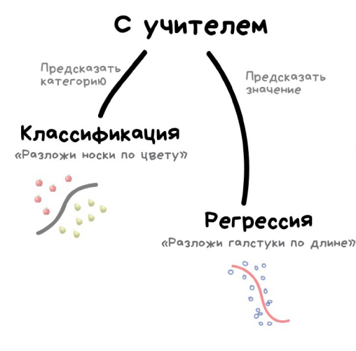

---
jupyter:
  jupytext:
    text_representation:
      extension: .md
      format_name: markdown
      format_version: '1.3'
      jupytext_version: 1.17.3
  kernelspec:
    display_name: Python 3 (ipykernel)
    language: python
    name: python3
---

<!-- #region editable=true jupyterlab-deck={"layer": "deck"} slideshow={"slide_type": "slide"} -->
# Лекция 8: Методы оценки качества модели в задачах обучения с учителем

Машинное обучение и анализ данных

МГТУ им. Н.Э. Баумана

Московский политехнический университет

Красников Александр Сергеевич

2024 -2025
<!-- #endregion -->

```python editable=true jupyterlab-deck={"layer": "slide"} slideshow={"slide_type": "slide"}
import itertools
import matplotlib.pyplot as plt
from matplotlib.pylab import rc, plot
import mglearn
import numpy as np
import pandas as pd
import seaborn as sns

from sklearn.linear_model import LogisticRegression
from sklearn.metrics import confusion_matrix
from sklearn.metrics import classification_report
from sklearn.metrics import precision_recall_curve
from sklearn.metrics import roc_auc_score
from sklearn.metrics import auc
from sklearn.metrics import roc_curve
from sklearn.metrics import log_loss
from sklearn.model_selection import train_test_split
from sklearn.preprocessing import LabelEncoder, OneHotEncoder
```

<!-- #region editable=true slideshow={"slide_type": "slide"} -->

<!-- #endregion -->

<!-- #region editable=true slideshow={"slide_type": "slide"} -->
## Задача - пример

Для наглядного представления метрик будем использовать датасет по оттоку клиентов телеком-оператора.
<!-- #endregion -->

```python editable=true slideshow={"slide_type": "fragment"}
data = pd.read_csv('./data/telecom_churn.csv')
data.head(5)
```

```python editable=true slideshow={"slide_type": "subslide"}
# Предобработка данных

# маппинг бинарных колонок
d = {'yes' : 1, 'no' : 0}

data['international plan'] = data['international plan'].map(d)
data['voice mail plan'] = data['voice mail plan'].map(d)
data['churn'] = data['churn'].astype('int64')

# закодируем dummy-кодированием штат
# для моделей на основе деревьев так лучше не делать
le = LabelEncoder()
data['state'] = le.fit_transform(data['state'])
ohe = OneHotEncoder(sparse_output=False)
encoded_state = ohe.fit_transform(data['state'].values.reshape(-1, 1))
tmp = pd.DataFrame(encoded_state,
                   columns=['state ' + str(i) for i in range(encoded_state.shape[1])])
data = pd.concat([data, tmp], axis=1)

# удаляем номер телефона (уникальный бесполезный признак)
data.drop(columns=['phone number'], inplace=True)

data.head(5)
```

```python editable=true slideshow={"slide_type": "subslide"}
# Применение логистической регрессии для решения задачи классификации

X = data.drop(columns=['churn'])
y = data.loc[:, ['churn']].values.ravel()

# делим выборку на train и test, все метрики будем оценивать на тестовом датасете
X_train, X_test, y_train, y_test = train_test_split(X, y, stratify=y, test_size=0.33, random_state=42)

# обучаем логистическую регрессию
lr = LogisticRegression(random_state=42, solver='newton-cholesky')
lr.fit(X_train, y_train);

# предсказание класса (0 или 1)
y_pred_bin = lr.predict(X_test)
print('Выборка каждого тридцатого элемента из y_pred_bin:', y_pred_bin[::30])

# предсказание вероятности положительного класса (клиент ушел)
y_pred_probs = lr.predict_proba(X_test)[:,1]
print('Выборка каждого тридцатого элемента из y_pred_probs:', np.round(y_pred_probs, 2)[::30])
```

<!-- #region editable=true slideshow={"slide_type": "slide"} -->
## Оценка и улучшение качества модели
<!-- #endregion -->

<!-- #region editable=true slideshow={"slide_type": "slide"} -->
### Перекрестная проверка (k-fold cross-validation)
<!-- #endregion -->

```python editable=true slideshow={"slide_type": "fragment"}
mglearn.plots.plot_cross_validation()
```

```python editable=true slideshow={"slide_type": "fragment"}
from sklearn.model_selection import cross_val_score

scores = cross_val_score(lr, X, y, cv=5)

print(f'Количество итераций: {len(scores)}')
print(f'Средняя правильность: {scores.mean():.2f}')
print(f'Значения правильности:\n{scores}')
```

<!-- #region editable=true slideshow={"slide_type": "slide"} -->
### Стратифицированная k-блочная перекрестная проверка (Stratified Cross-validation)
<!-- #endregion -->

```python editable=true slideshow={"slide_type": "fragment"}
mglearn.plots.plot_stratified_cross_validation()
```

```python editable=true slideshow={"slide_type": "fragment"}
from sklearn.model_selection import KFold

kfold = KFold(n_splits=5, shuffle=True, random_state=42)
scores = cross_val_score(lr, X, y, cv=kfold)

print(f'Количество итераций: {len(scores)}')
print(f'Средняя правильность: {scores.mean():.2f}')
print(f'Значения правильности:\n{scores}')
```

<!-- #region editable=true slideshow={"slide_type": "slide"} -->
### Перекрестная проверка с исключением по одному (leave-one-out)
<!-- #endregion -->

```python editable=true slideshow={"slide_type": "fragment"}
# !!! Осторожно. Очень долго
from sklearn.model_selection import LeaveOneOut

loo = LeaveOneOut()
scores = cross_val_score(lr, X, y, cv=loo)

print(f'Количество итераций: {len(scores)}')
print(f'Средняя правильность: {scores.mean():.2f}')
print(f'Значения правильности:\n{scores}')
```

<!-- #region editable=true slideshow={"slide_type": "slide"} -->
### Перекрестная проверка со случайными перестановками при разбиении (shuffle-split cross-validation).
<!-- #endregion -->

```python editable=true slideshow={"slide_type": "fragment"}
mglearn.plots.plot_shuffle_split()
```

```python editable=true slideshow={"slide_type": "fragment"}
from sklearn.model_selection import ShuffleSplit

shuffle_split = ShuffleSplit(test_size=.5, train_size=.5, n_splits=10)
scores = cross_val_score(lr, X, y, cv=shuffle_split)

print(f'Количество итераций: {len(scores)}')
print(f'Средняя правильность: {scores.mean():.2f}')
print(f'Значения правильности:\n{scores}')
```

<!-- #region editable=true slideshow={"slide_type": "slide"} -->
### Перекрестная проверка с использованием групп (GroupKFold)
<!-- #endregion -->

```python editable=true slideshow={"slide_type": "fragment"}
mglearn.plots.plot_group_kfold()
```

```python editable=true slideshow={"slide_type": "fragment"}
from sklearn.model_selection import GroupKFold
from sklearn.datasets import make_blobs

# создаем синтетический набор данных
X_, y_ = make_blobs(n_samples=12, random_state=42)
# предположим, что первые три примера относятся к одной и той же группе,
# затем следующие четыре и так далее.
groups = [0, 0, 0, 1, 1, 1, 1, 2, 2, 3, 3, 3]

scores = cross_val_score(lr, X=X_, y=y_, groups=groups, cv=GroupKFold(n_splits=3))


print(f'Количество итераций: {len(scores)}')
print(f'Средняя правильность: {scores.mean():.2f}')
print(f'Значения правильности:\n{scores}')
```

<!-- #region editable=true slideshow={"slide_type": "slide"} -->
### Простой поиск по сетке


<!-- #endregion -->

```python editable=true slideshow={"slide_type": "fragment"}
# реализация простого поиска по сетке
from sklearn.svm import SVC

X_train, X_test, y_train, y_test = train_test_split(X, y, test_size=0.33, random_state=42)

print(f'Размер обучающего набора: {X_train.shape[0]} размер тестового набора: {X_test.shape[0]}')

best_score = 0
for gamma in [0.001, 0.01, 0.1, 1, 10, 100]:
    for C in [0.001, 0.01, 0.1, 1, 10, 100]:
        # для каждой комбинации параметров обучаем SVC
        svm = SVC(gamma=gamma, C=C)
        svm.fit(X_train, y_train)
        # оцениваем качество SVC на тестовом наборе
        score = svm.score(X_test, y_test)
        # если получаем наилучшее значение правильности, сохраняем значение и параметры
        if score > best_score:
            best_score = score
            best_parameters = {'C': C, 'gamma': gamma}

print(f'Наилучшее значение правильности: {best_score:.2f}')
print(f'Наилучшие значения параметров: {best_parameters}')
```

<!-- #region editable=true slideshow={"slide_type": "slide"} -->
### Опасность переобучения и проверочный набор данных
<!-- #endregion -->

```python editable=true slideshow={"slide_type": "fragment"}
mglearn.plots.plot_threefold_split()
```

<!-- #region editable=true slideshow={"slide_type": "slide"} -->
### Поиск по сетке с перекрестной проверкой
<!-- #endregion -->

```python editable=true slideshow={"slide_type": "fragment"}
from sklearn.svm import SVC

# разбиваем данные на обучающий+проверочный набор и тестовый набор
X_trainval, X_test, y_trainval, y_test = train_test_split(X, y, test_size=0.33, random_state=42)
# разбиваем обучающий+проверочный набор на обучающий и проверочный наборы
X_train, X_valid, y_train, y_valid = train_test_split(X_trainval, y_trainval, random_state=42)

print(f'Размер обучающего набора: {X_train.shape[0]}')
print(f'Размер проверочного набора: {X_valid.shape[0]}')
print(f'Размер тестового набора: {X_test.shape[0]}')

best_score = 0
for gamma in [0.001, 0.01, 0.1, 1, 10, 100]:
    for C in [0.001, 0.01, 0.1, 1, 10, 100]:
        # для каждой комбинации параметров обучаем SVC
        svm = SVC(gamma=gamma, C=C)
        svm.fit(X_train, y_train)
        # оцениваем качество SVC на тестовом наборе
        score = svm.score(X_valid, y_valid)
        # если получаем наилучшее значение правильности, сохраняем значение и параметры
        if score > best_score:
            best_score = score
            best_parameters = {'C': C, 'gamma': gamma}

# заново строим модель на наборе, полученном в результате объединения обучающих
# и проверочных данных, оцениваем качество модели на тестовом наборе
svm = SVC(**best_parameters)
svm.fit(X_trainval, y_trainval)
test_score = svm.score(X_test, y_test)

print(f'\nЛучшее значение правильности на проверочном наборе: {best_score:.2f}')
print(f'Наилучшие значения параметров: {best_parameters}')
print(f'Правильность на тестовом наборе с наилучшими параметрами: {test_score:.2f}')
```

```python editable=true slideshow={"slide_type": "subslide"}
mglearn.plots.plot_cross_val_selection()
```

```python editable=true slideshow={"slide_type": "subslide"}
mglearn.plots.plot_grid_search_overview()
```

```python editable=true slideshow={"slide_type": "subslide"}
from sklearn.model_selection import GridSearchCV
from sklearn.svm import SVC

param_grid = {'C': [0.001, 0.01, 0.1, 1, 10, 100],
              'gamma': [0.001, 0.01, 0.1, 1, 10, 100]}
print(f'Сетка параметров:\n{param_grid}')

grid_search = GridSearchCV(SVC(), param_grid, cv=5)

X_train, X_test, y_train, y_test = train_test_split(X, y, test_size=0.33, random_state=42)
grid_search.fit(X_train,y_train)

print(f'Правильность на тестовом наборе: {grid_search.score(X_test, y_test):.2f}')
print(f'Наилучшие значения параметров: {grid_search.best_params_}')
print(f'Наилучшее значение кросс-валидац. правильности:{grid_search.best_score_:.2f}')

print(f'Наилучшая модель:\n{grid_search.best_estimator_}')
```
